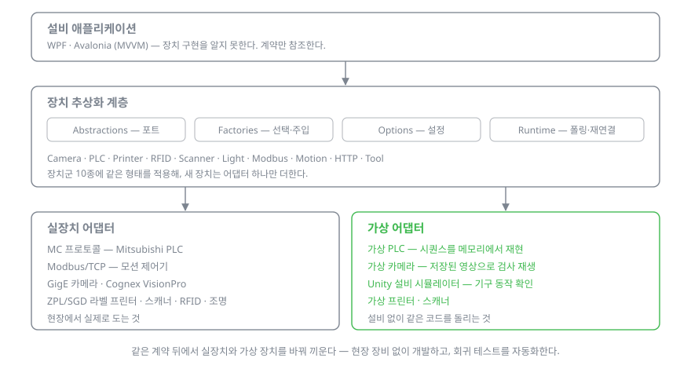

# 설비 없이 설비 소프트웨어 만들기

애플리케이션은 `IPlcClient`, `ICam` 같은 포트만 안다. 그 뒤에 실제로 무엇이 붙는지는 팩토리가 설정을 보고 정한다. 장치 열 종류가 같은 골격을 쓴다 — `Abstractions`(포트) · `Clients`(어댑터) · `Factories`(선택) · `Options`(설정) · `Runtime`(폴링·재연결).

**가상 어댑터**
- 가상 PLC — 시퀀스를 메모리에서 재현한다. 설비를 잡지 않고 공정을 처음부터 끝까지 돌린다.
- 가상 카메라 — 저장해 둔 현장 영상을 다시 흘려보낸다. 같은 장면을 몇 번이고 재생하며 판정을 고친다.
- Unity 시뮬레이터 — 기구 동작을 눈으로 확인한다.

같은 코드가 양쪽에서 그대로 돈다. 테스트용 분기를 코드에 넣지 않는다 — 분기가 있으면 "시뮬에서는 되는데"가 생긴다.

**교체**
Windows COM에 묶여 있던 PLC 통신을 순수 .NET 소켓 구현으로 갈아 끼울 때, 애플리케이션 코드는 한 줄도 건드리지 않았다.

**한계**
- 가상 어댑터도 결국 유지해야 하는 코드다. 실장치 동작이 바뀌었는데 가상 쪽을 따라 고치지 않으면 통과하는 테스트가 오히려 거짓말을 한다. 구조로 막을 수가 없다.
- 모든 장치가 이 구조에 잘 맞지도 않는다. 상태가 거의 없는 장치까지 포트·팩토리·옵션을 다 만드는 건 과해서, 그런 곳은 얇게 뒀다.
